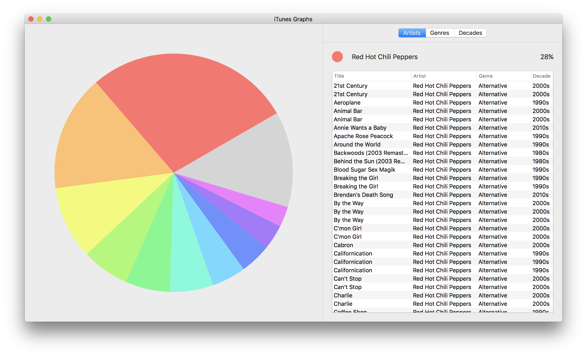

# iTunes Graphs

iTunes Graphs is a Cocoa-based macOS app which visualises your iTunes library in a series of pie charts.
Currently, it supports the following graphs:

 - Artists
 - Genres
 - Decades

There's no build on GitHub at the moment, so you'll have to build it yourself from Xcode. Use Xcode 8.
